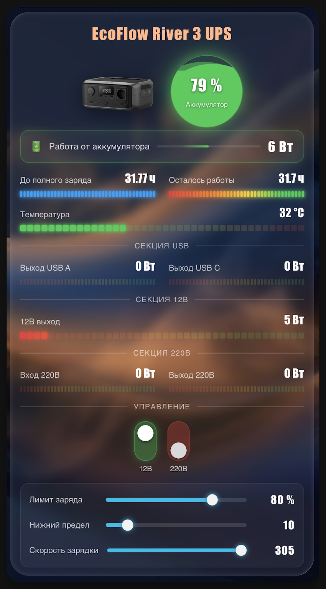

# ⚡ Noema Power Card

<p align="left">
  
</p>

🇺🇸 [English](README.md) • 🇷🇺 [Русский](README_RU.md)

> **A modern all-in-one Lovelace dashboard card for Home Assistant.**
>
> Beautiful neon LED bars, animated liquid battery visualization, neumorphic controls, historical graphs, and a visual configuration editor — all in a **single JavaScript file**.

Part of the **Noema** ecosystem of smart home projects by **[e2ret](https://github.com/e2ret)**.

---

## ✨ Features

### 🎨 Modern UI
- 🌈 Animated **Neon LED Bars**
- 💧 Interactive **Liquid Battery Sphere**
- ⚡ Animated **Energy Flow Indicator**
- 🟢 Neumorphic Buttons
- 🎛️ Vertical Toggle Switches
- 🎚️ Neon Sliders for Number entities

### 📊 Smart Visualization
- 📈 SVG history graphs
- 🖼️ Hero image with background charts
- 🌊 Animated battery waves
- ✨ Charging / discharging effects
- 💥 Pulse animation on discharge

### ⚙️ Flexible Configuration
- 🧩 Visual GUI Editor
- 📦 Zero required fields
- 🖱️ Click any tile for Home Assistant **more-info**
- 📐 One or two column layout
- 🔧 Supports virtually any numeric sensor

### 🌍 Internationalization (v1.1+)
- Automatic language detection from Home Assistant
- Built-in **English** and **Russian**
- Easy to add more languages (translations embedded in the single JS file)

---

## 🚀 Why Noema Power Card?

Unlike traditional dashboard cards, **Noema Power Card** combines multiple UI components into one lightweight card.

✅ No dependencies  
✅ No card-mod  
✅ No Mushroom  
✅ No Bar Card  
✅ No custom themes  
✅ Just one JavaScript file  

---

## 📦 Installation

### Install via HACS (Recommended)

1. Open **HACS**
2. Go to **⋮ → Custom repositories**
3. Add:

```
https://github.com/e2ret/noema-power-card
```

Category:

```
Dashboard
```

4. Install the card
5. Reload your browser (**Ctrl + Shift + R**)

### Manual Installation

Copy

```
dist/noema-power-card.js
```

to

```
/config/www/
```

Then add the resource:

```yaml
resources:
  - url: /local/noema-power-card.js
    type: module
```

or, when installed through HACS:

```yaml
resources:
  - url: /hacsfiles/noema-power-card/noema-power-card.js
    type: module
```

---

## 🧩 Example Configuration

```yaml
type: custom:noema-power-card
title: EcoFlow River 3 UPS
image: /local/images/river3.png
graph_entity_1: sensor.battery_level
graph_entity_2: sensor.cell_temperature
graph_hours: 24
sensors:
  - entity: sensor.battery_level
    name: Battery
    unit: "%"
    style: liquid
    wide: true
    flow_in: sensor.battery_input_power
    flow_out: sensor.battery_output_power
  - entity: sensor.cell_temperature
    name: Temperature
    unit: °C
    color: heat
    min: 15
    max: 60
    wide: true
buttons:
  - entity: button.proxmox_reboot
    name: Reboot
    button_type: push
    btn_color: yellow
  - entity: button.proxmox_shutdown
    name: Shutdown
    button_type: push
    btn_color: red
  - entity: switch.dc_12v_port
    name: 12V
controls:
  - entity: number.battery_charge_limit_max
    name: Charge Limit
    unit: "%"
```

---

## 📊 Sensor Options

| Option     | Description                          |
|------------|--------------------------------------|
| `entity`   | Sensor entity                        |
| `name`     | Display name                         |
| `unit`     | Unit of measurement                  |
| `style`    | `bar` or `liquid`                    |
| `color`    | `level`, `heat`, `good`, `warn`, `bad`, `info` |
| `min`      | Minimum value                        |
| `max`      | Maximum value                        |
| `decimals` | Decimal places                       |
| `wide`     | Full-width cell                      |
| `invert`   | Reverse gradient & spark direction   |
| `animate`  | Running spark (enabled by default)   |
| `flow_in`  | Charging power sensor (W)            |
| `flow_out` | Discharging power sensor (W)         |

---

## 🔘 Button Options

| Option        | Description                              |
|---------------|------------------------------------------|
| `entity`      | switch / button / script / input_boolean |
| `name`        | Display name                             |
| `button_type` | `toggle` or `push`                       |
| `btn_color`   | `cyan`, `red`, `yellow`, `green`, `blue` |
| `confirm`     | Confirmation dialog (default: true)      |

---

## 🎚️ Control Options

| Option   | Description                |
|----------|----------------------------|
| `entity` | number / input_number      |
| `name`   | Display name               |
| `unit`   | Unit shown next to value   |
| `min`    | Override min               |
| `max`    | Override max               |
| `step`   | Override step              |

---

## 🔌 Compatible Integrations

Works with virtually any integration exposing numeric sensors, including:

- 🔋 EcoFlow BLE
- ☁️ ecoflow-cloud
- 🔌 NUT (Network UPS Tools)
- 🖥️ Proxmox
- 🏠 ESPHome
- 📡 MQTT
- ⚡ Any Home Assistant numeric entity

---

## 🖼️ Screenshots

| Dashboard | Controls |
|-----------|----------|
|  | *(Add another screenshot here)* |

---

## 💡 Use Cases

Perfect for monitoring:

- 🔋 Portable Power Stations
- ⚡ UPS Systems
- 🏠 Home Energy Storage
- ☀️ Solar Installations
- 🔌 Smart Power Distribution
- 🖥️ Home Labs
- 🏡 Smart Homes

---

## 🌍 Languages

The card and its visual editor automatically follow the language of your Home Assistant instance.

| Language | Status |
|----------|--------|
| English  | ✅ Built-in |
| Russian  | ✅ Built-in |

Additional languages can be added by extending the translation dictionary inside the single JS file (or by contributing a PR).

---

## ❤️ Part of the Noema Ecosystem

**Noema** is a collection of modern Home Assistant components focused on elegant design, smooth animations, and exceptional usability.

---

## 📄 License

Licensed under the **MIT License**.
