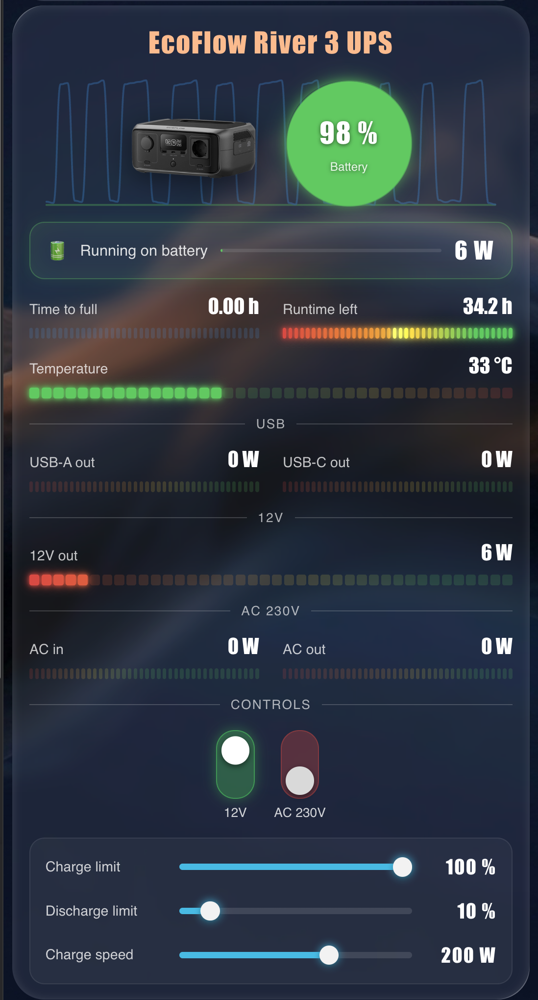

# ⚡ Noema Power Card

<p align="left">
  
</p>

🇷🇺 [Русский](README_RU.md) • 🇺🇸 [English](README.md)

> **Современная универсальная Lovelace-карта для Home Assistant.**
>
> Красивые неоновые LED-индикаторы, анимированный «жидкий» аккумулятор, элементы в стиле neumorphism, графики истории и визуальный редактор настройки — всё в **одном JavaScript-файле**.

Часть экосистемы **Noema** — современных компонентов для Home Assistant от **[e2ret](https://github.com/e2ret)**.

---

## ✨ Возможности

### 🎨 Современный интерфейс
- 🌈 Анимированные **неоновые LED-бары**
- 💧 **Жидкий шар аккумулятора** с волнами
- ⚡ Анимированная **индикация потока энергии**
- 🟢 Кнопки в стиле **Neumorphism**
- 🎛️ Вертикальные переключатели
- 🎚️ Неоновые слайдеры для Number-сущностей

### 📊 Наглядная визуализация
- 📈 SVG-графики истории
- 🖼️ Hero-блок с изображением устройства
- 🌊 Анимированные волны уровня заряда
- ✨ Эффекты зарядки и разрядки
- 💥 Пульсация при работе от аккумулятора

### ⚙️ Гибкая настройка
- 🧩 Визуальный редактор (GUI)
- 📦 Без обязательных параметров
- 🖱️ Клик по любой ячейке открывает **more-info**
- 📐 Макет в одну или две колонки
- 🔧 Поддержка практически любых числовых сенсоров

### 🌍 Мультиязычность (v1.1+)
- Автоматическое определение языка Home Assistant
- Встроенные **русский** и **английский**
- Легко добавить другие языки (переводы встроены в один JS-файл)

---

## 🚀 Почему Noema Power Card?

В отличие от большинства карточек Home Assistant, **Noema Power Card** объединяет множество элементов интерфейса в одной лёгкой карточке.

✅ Без зависимостей  
✅ Без card-mod  
✅ Без Mushroom  
✅ Без Bar Card  
✅ Без сторонних тем  
✅ Только один JavaScript-файл  

---

## 📦 Установка

### Установка через HACS (рекомендуется)

1. Откройте **HACS**
2. Перейдите в **⋮ → Пользовательские репозитории**
3. Добавьте репозиторий:

```
https://github.com/e2ret/noema-power-card
```

Категория:

```
Dashboard
```

4. Установите карточку.
5. Обновите страницу браузера (**Ctrl + Shift + R**).

### Ручная установка

Скопируйте файл

```
dist/noema-power-card.js
```

в каталог

```
/config/www/
```

После этого добавьте ресурс:

```yaml
resources:
  - url: /local/noema-power-card.js
    type: module
```

или, если карточка установлена через HACS:

```yaml
resources:
  - url: /hacsfiles/noema-power-card/noema-power-card.js
    type: module
```

---

## 🧩 Пример конфигурации

```yaml
type: custom:noema-power-card
title: EcoFlow River 3 UPS
image: /local/images/river3.png
graph_entity_1: sensor.battery_level
graph_entity_2: sensor.cell_temperature
graph_hours: 24
sensors:
  - entity: sensor.battery_level
    name: Аккумулятор
    unit: "%"
    style: liquid
    wide: true
    flow_in: sensor.battery_input_power
    flow_out: sensor.battery_output_power
  - entity: sensor.cell_temperature
    name: Температура
    unit: °C
    color: heat
    min: 15
    max: 60
    wide: true
buttons:
  - entity: button.proxmox_reboot
    name: Перезагрузить
    button_type: push
    btn_color: yellow
  - entity: button.proxmox_shutdown
    name: Выключить
    button_type: push
    btn_color: red
  - entity: switch.dc_12v_port
    name: 12 В
controls:
  - entity: number.battery_charge_limit_max
    name: Лимит заряда
    unit: "%"
```

---

## 📊 Параметры сенсоров

| Параметр   | Описание                                      |
|------------|-----------------------------------------------|
| `entity`   | Сущность                                      |
| `name`     | Отображаемое название                         |
| `unit`     | Единица измерения                             |
| `style`    | `bar` или `liquid`                            |
| `color`    | `level`, `heat`, `good`, `warn`, `bad`, `info`|
| `min`      | Минимальное значение                          |
| `max`      | Максимальное значение                         |
| `decimals` | Знаков после запятой                          |
| `wide`     | Ячейка на всю ширину                          |
| `invert`   | Инверсия градиента и направления искры        |
| `animate`  | Бегущая искра (включена по умолчанию)         |
| `flow_in`  | Сенсор мощности зарядки (Вт)                  |
| `flow_out` | Сенсор мощности разрядки (Вт)                 |

---

## 🔘 Параметры кнопок

| Параметр      | Описание                                   |
|---------------|--------------------------------------------|
| `entity`      | switch / button / script / input_boolean   |
| `name`        | Отображаемое название                      |
| `button_type` | `toggle` или `push`                        |
| `btn_color`   | `cyan`, `red`, `yellow`, `green`, `blue`   |
| `confirm`     | Окно подтверждения (по умолчанию: true)    |

---

## 🎚️ Параметры регуляторов

| Параметр | Описание                     |
|----------|------------------------------|
| `entity` | number / input_number        |
| `name`   | Отображаемое название        |
| `unit`   | Единица рядом со значением   |
| `min`    | Переопределить минимум       |
| `max`    | Переопределить максимум      |
| `step`   | Переопределить шаг           |

---

## 🔌 Совместимые интеграции

Карточка работает практически с любыми интеграциями Home Assistant, предоставляющими числовые сенсоры, включая:

- 🔋 EcoFlow BLE
- ☁️ ecoflow-cloud
- 🔌 NUT (Network UPS Tools)
- 🖥️ Proxmox
- 🏠 ESPHome
- 📡 MQTT
- ⚡ Любые числовые сущности Home Assistant

---

## 💡 Где можно использовать

Идеально подходит для отображения:

- 🔋 Портативных электростанций
- ⚡ Источников бесперебойного питания (UPS)
- 🏠 Домашних систем хранения энергии
- ☀️ Солнечных электростанций
- 🔌 Систем распределения питания
- 🖥️ Домашних серверов и лабораторий
- 🏡 Умного дома

---

## 🌍 Языки

Карточка и визуальный редактор автоматически следуют языку вашего Home Assistant.

| Язык     | Статус     |
|----------|------------|
| Русский  | ✅ Встроен |
| English  | ✅ Встроен |

Другие языки можно добавить, расширив словарь переводов внутри единственного JS-файла (или через PR).

---

## ❤️ Часть экосистемы Noema

**Noema** — это коллекция современных компонентов для Home Assistant с акцентом на красивый дизайн, плавные анимации и удобство использования.

---

## 📄 Лицензия

Распространяется по лицензии **MIT**.
